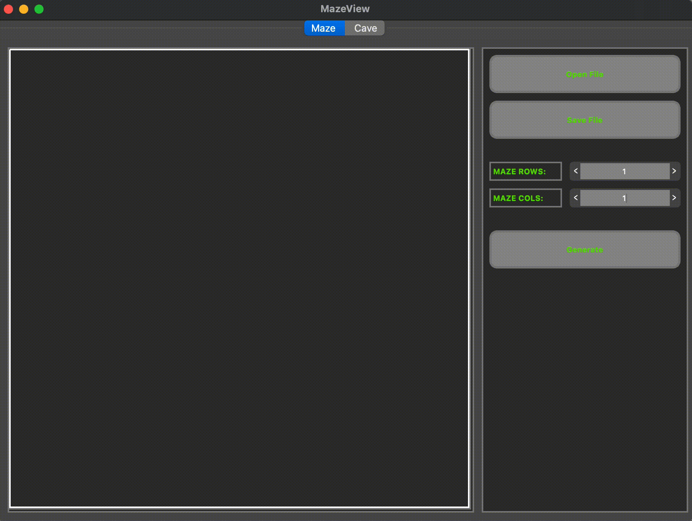

# A1_Maze



## Информация:

Реализована программа Maze.app, позволяющая генерировать и отрисовывать идеальные (без изолированных областей и зациклеваний) лабиринты.

## Описание лабиринта

Лабиринт может храниться в файле в виде количества строк и столбцов, а также двух матриц, содержащих положение вертикальных и горизонтальных стен соответственно. 
В первой матрице отображается наличие стены справа от каждой ячейки, а во второй - снизу. 

Пример подобного файла:  
```
4 4
0 0 0 1
1 0 1 1
0 1 0 1
0 0 0 1

1 0 1 0
0 0 1 0
1 1 0 1
1 1 1 1
```

## Установка:

Для установки перейдите в папку src и запустите `make install`.